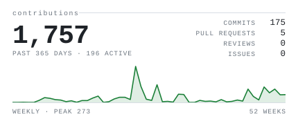
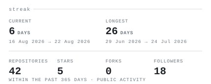
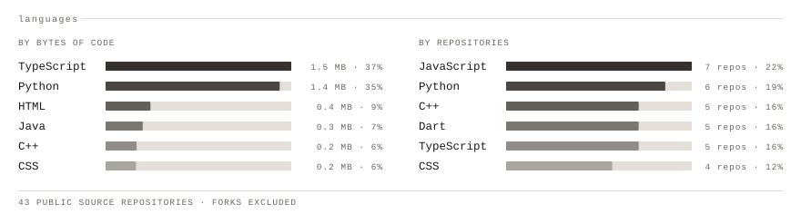

  <picture>
    <source media="(prefers-color-scheme: dark)" srcset="portrait-dark.svg">
    
  </picture>

<picture>
  <source media="(prefers-color-scheme: dark)" srcset="hd-name-dark.svg">
  
</picture>

> I build tools for people who build with AI agents — small, sharp things that 
> make a coding agent behave more like a colleague and less like a slot machine. 
> Currently founding engineer at <b>First Concepts</b>, finishing an MSc at <b>UCL</b>.

<picture>
  <source media="(prefers-color-scheme: dark)" srcset="hd-work-dark.svg">
  
</picture>

**[focus-mode](https://github.com/mustafa3252/focus-mode)** — an action-first output
mode for builders and AI coding agents. 
<samp>agent tooling · output modes</samp>

**[vibe-code-map](https://github.com/mustafa3252/vibe-code-map)** — generates a tiny
repo context map for Claude, Cursor, Codex and other coding agents, so they stop 
guessing at your project layout. 
<samp>JavaScript · context engineering</samp>

**[vibe-loop-engineering](https://github.com/mustafa3252/vibe-loop-engineering)** — a
practical loop-engineering kit for working with agents instead of against them. 
<samp>method · prompting</samp>

**[chameleon](https://github.com/mustafa3252/chameleon)** — TypeScript, and the most
starred thing here. 
<samp>TypeScript</samp>

**[pixelhq](https://github.com/mustafa3252/pixelhq)** — an interactive isometric
virtual office, built with Phaser. 
<samp>JavaScript · Phaser</samp>

<picture>
  <source media="(prefers-color-scheme: dark)" srcset="hd-stack-dark.svg">
  
</picture>

<samp>TypeScript</samp> · <samp>Python</samp> · <samp>JavaScript</samp> ·
<samp>C++</samp> · <samp>Java</samp> · <samp>Dart</samp> 
<samp>React</samp> · <samp>Node</samp> · <samp>Phaser</samp> ·
<samp>PyTorch</samp> · <samp>Postgres</samp>

<picture>
  <source media="(prefers-color-scheme: dark)" srcset="hd-signals-dark.svg">
  
</picture>

<picture>
  <source media="(prefers-color-scheme: dark)" srcset="stats-dark.svg">
  
</picture>
<picture>
  <source media="(prefers-color-scheme: dark)" srcset="streak-dark.svg">
  
</picture>

<picture>
  <source media="(prefers-color-scheme: dark)" srcset="langs-dark.svg">
  
</picture>

<picture>
  <source media="(prefers-color-scheme: dark)" srcset="year-dark.svg">
  
</picture>

<picture>
  <source media="(prefers-color-scheme: dark)" srcset="hd-elsewhere-dark.svg">
  
</picture>

<samp>site</samp> &nbsp; [mustafaafricawala.com](https://www.mustafaafricawala.com/) 
<samp>work</samp> &nbsp; [First Concepts](https://github.com/First-Concepts) 
<samp>code</samp> &nbsp; [github.com/mustafa3252](https://github.com/mustafa3252)

<samp>how this page draws itself</samp>

 

Everything above is generated inside this repository. There are no third-party
widgets, no stats services, and no external image hosts — the page makes zero
requests off github.com, so nothing here can rate-limit or go dark.

<samp>scripts/make_portrait.py</samp> turns a photograph into the portrait:
background removal, a tight crop to the face, local contrast, then a map onto a
13-step character ramp. Each row is clipped by a rect that animates its width
from zero, with a block riding the wipe edge as a cursor — SMIL, because GitHub
strips scripts. Every animation is <samp>fill="freeze"</samp>, so the portrait
prints once and stops rather than looping forever in your peripheral vision.

<samp>scripts/generate_stats.py</samp> draws the four graphics from the GitHub
GraphQL API using only the Python standard library. A scheduled action reruns it
each morning and commits only when a number actually changed.

Headings are images because GitHub strips <samp>&lt;style&gt;</samp>,
<samp>style=""</samp>, <samp>class=""</samp> and inline SVG from README markdown
— an image is the only way to put a chosen typeface on the page. The cost is
real and worth stating: image headings have no anchor links, so this README has
no outline. The alt text carries each word.

Fonts are subset per role and inlined as base64 <samp>@font-face</samp> rules.
An external font URL cannot work here, because these SVGs load through
<samp>&lt;img&gt;</samp> and browsers refuse subresource fetches for image
documents. JetBrains Mono is used throughout — SIL OFL 1.1, licence shipped in
<samp>assets/fonts/</samp> — and its 600/1000 advance width is exactly the
0.600 em the character grid assumes, so the portrait is the same width on every
operating system.

