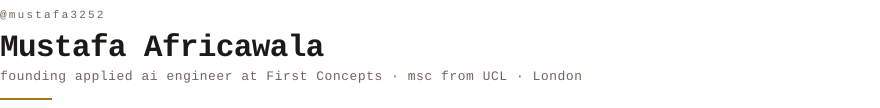
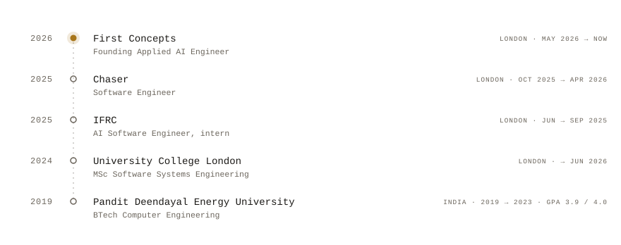
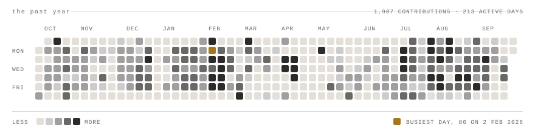

  <picture>
    <source media="(prefers-color-scheme: dark)" srcset="portrait-dark.svg">
    
  </picture>

<picture>
  <source media="(prefers-color-scheme: dark)" srcset="hd-name-dark.svg">
  
</picture>

> Applied AI engineer in London. I build agent systems, and the evaluation 
> layer that tells you whether they're actually working. Mostly that's 
> architecture, LLM-as-judge harnesses, and the tracing underneath both. 
> Right now I'm founding engineer at First Concepts. I recently finished an 
> MSc at UCL, and I teach 24k people to code on the side.

<picture>
  <source media="(prefers-color-scheme: dark)" srcset="hd-experience-dark.svg">
  
</picture>

<picture>
  <source media="(prefers-color-scheme: dark)" srcset="timeline-dark.svg">
  
</picture>

<picture>
  <source media="(prefers-color-scheme: dark)" srcset="hd-projects-dark.svg">
  
</picture>

**[openOffice](https://github.com/mustafa3252/openOffice)** — the work-from-bed
era, made literal. 
<samp>Python</samp>

**[vibe-ship-skills](https://github.com/mustafa3252/vibe-ship-skills)** — agent
skills for shipping: move fast, verify faster, ship cleaner. 
<samp>agent tooling</samp>

**[TDD in practice](https://github.com/Andrei-Constantin-Programmer/TDD_In_Practice)**
— mining git history across 405 Apache repositories to measure how much
test-driven development actually happens. With
[@Andrei-Constantin-Programmer](https://github.com/Andrei-Constantin-Programmer). 
<samp>Python · PyDriller</samp>

**[chameleon](https://github.com/mustafa3252/chameleon)** — COBOL-to-Python
migration tool, built at a hackathon. 
<samp>TypeScript</samp>

**[vibe-loop-engineering](https://github.com/mustafa3252/vibe-loop-engineering)**
— a practical loop-engineering kit for people building with AI agents. 
<samp>method</samp>

<picture>
  <source media="(prefers-color-scheme: dark)" srcset="hd-stack-dark.svg">
  
</picture>

<samp>LANGUAGES</samp> 
Python · TypeScript · JavaScript · C++ · SQL

<samp>AGENTS &amp; LLM</samp> 
LangChain · LangGraph · LangSmith · Langfuse · LlamaIndex · Mastra · BAML ·
Pydantic · PyTorch

<samp>PLATFORM</samp> 
React · Node · Django · Postgres · Supabase · Convex · Azure · Docker ·
GitHub Actions

<picture>
  <source media="(prefers-color-scheme: dark)" srcset="hd-contributions-dark.svg">
  
</picture>

<picture>
  <source media="(prefers-color-scheme: dark)" srcset="year-dark.svg">
  
</picture>

<picture>
  <source media="(prefers-color-scheme: dark)" srcset="hd-elsewhere-dark.svg">
  
</picture>

<samp>site</samp> &nbsp; [mustafaafricawala.com](https://www.mustafaafricawala.com/) 
<samp>work</samp> &nbsp; [First Concepts](https://github.com/First-Concepts) 
<samp>teaching</samp> &nbsp; [@mustafaiscoding](https://www.instagram.com/mustafaiscoding/) — DS&amp;A and testing explainers, 24k followers 
<samp>code</samp> &nbsp; [github.com/mustafa3252](https://github.com/mustafa3252)

<samp>how this page draws itself</samp>

 

Everything above is generated inside this repository. No third-party widgets, no
stats services, no external image hosts — the page makes zero requests off
github.com, so nothing here can rate-limit or go dark.

<samp>make_portrait.py</samp> turns a photograph into the portrait: background
removal, a tight crop to the face, local contrast, then a map onto a 13-step
character ramp. Each row is clipped by a rect animating its width from zero,
with a block riding the wipe edge as a cursor — SMIL, because GitHub strips
scripts. Every animation is <samp>fill="freeze"</samp>, so it prints once and
stops rather than looping in your peripheral vision.

<samp>make_timeline.py</samp> draws the dotted timeline. The one filled node is
the one entry that has not ended, which is also the only brass on the graphic —
the accent is spent on status, never on decoration.

<samp>generate_stats.py</samp> draws the contribution grid from the GitHub
GraphQL API using only the Python standard library. A scheduled action reruns
it each morning and commits only when a number actually changed: the window is
pinned to whole UTC days, so two runs produce byte-identical files instead of a
nightly stream of noise. One square is defined once and referenced 365 times,
so each day costs only its coordinates.

Headings are images because GitHub strips <samp>&lt;style&gt;</samp>,
<samp>style=""</samp>, <samp>class=""</samp> and inline SVG from README
markdown; an image is the only way to put a chosen typeface on the page. The
cost is real and worth stating: image headings have no anchor links, so this
README has no outline. The alt text carries each word.

Fonts are subset per role and inlined as base64 <samp>@font-face</samp> rules.
An external font URL cannot work here, because these SVGs load through
<samp>&lt;img&gt;</samp> and browsers refuse subresource fetches for image
documents. JetBrains Mono throughout — SIL OFL 1.1, licence shipped in
<samp>assets/fonts/</samp> — and its 600/1000 advance width is exactly the
0.600 em the character grid assumes, so the portrait is the same width on every
operating system.

